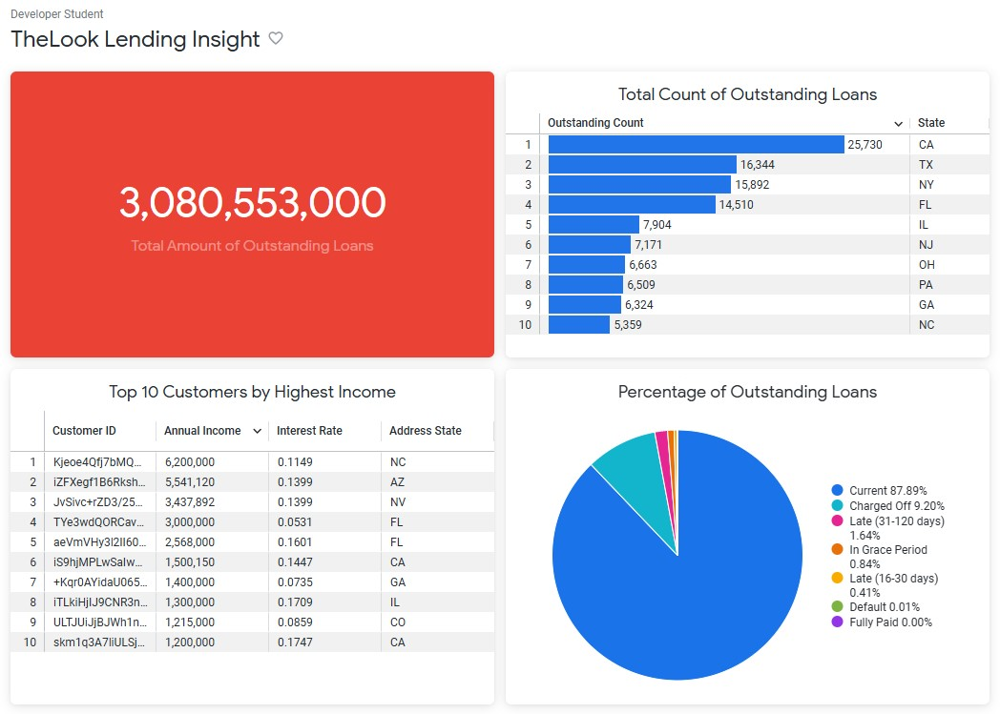
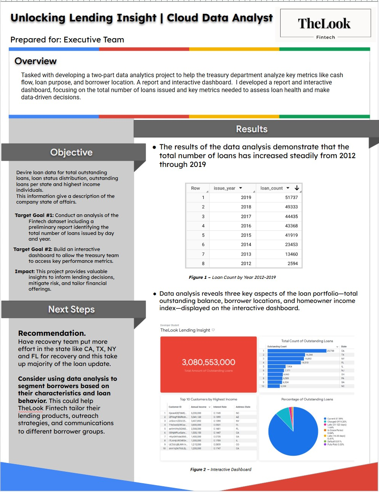

# Capstone-Project
## 📌 Project Scope – Treasury Analytics & Dashboarding at TheLook Fintech

### 🏢 Client: TheLook Fintech  
A growth-stage fintech startup that offers inventory loans to independent online store owners. The company is rapidly scaling and aiming to enhance data-driven decision-making across departments—starting with Treasury.

### 🎯 Objective

Support TheLook Fintech’s Treasury department by developing a cloud-based data solution that enables them to track loan performance, monitor growth metrics, and make timely, informed decisions using real-time data.

### 🧩 Scope of Work

As a Cloud Data Analyst, the key responsibilities and deliverables of the capstone project include:

1. **🔍 Data Collection**  
   - Aggregate raw data from various business systems (loan applications, repayment logs, customer details, etc.)

2. **☁️ Data Storage & Processing**  
   - Use **Google BigQuery** to clean, process, and store structured data in a scalable cloud environment.

3. **📊 Data Analysis & Visualization**  
   - Analyze processed datasets to uncover trends, segment insights, and performance metrics.
   - Develop interactive visualizations and self-service dashboards in **Looker Enterprise** focused on:
     - Total outstanding loans
     - Loan status breakdown
     - Geographic distribution
     - Customer homeownership vs. loan status

4. **📈 Insights Activation**  
   - Enable cross-filtering and drill-downs for stakeholder interaction
   - Share dashboards and generate automated reports that support real-time decision-making as shown: 

     
   

5. **📝 Executive Summary**  
   - Document the full process and findings in a professional executive summary, suitable for stakeholders and portfolio inclusion.
See below:  
 

### 🔧 Tools & Technologies

| Tool                  | Purpose                               |
|-----------------------|---------------------------------------|
| **BigQuery**          | Cloud-based data processing & storage |
| **Looker Enterprise** | Data modeling, analysis & dashboards  |

### 📦 Deliverables

- BigQuery SQL pipelines and schema for processed Treasury data
- Looker dashboard(s) for loan health and performance
- A short executive summary capturing insights, outcomes, and impact
- Documentation for end-user interaction and data refresh processes

